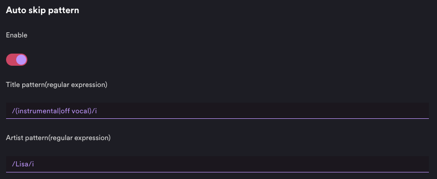

# Auto Skip Pattern

Automatically skip songs using regular expression patterns.

## Getting Started

After placing the extension file into correct folder, run following command to install it:

```sh
spicetify config extensions autoSkipPattern.js
spicetify apply
```

## Usage

Enter the pattern on the Spotify client settings page.

## Preview



## Made with Spicetify Creator

- https://github.com/spicetify/spicetify-creator
